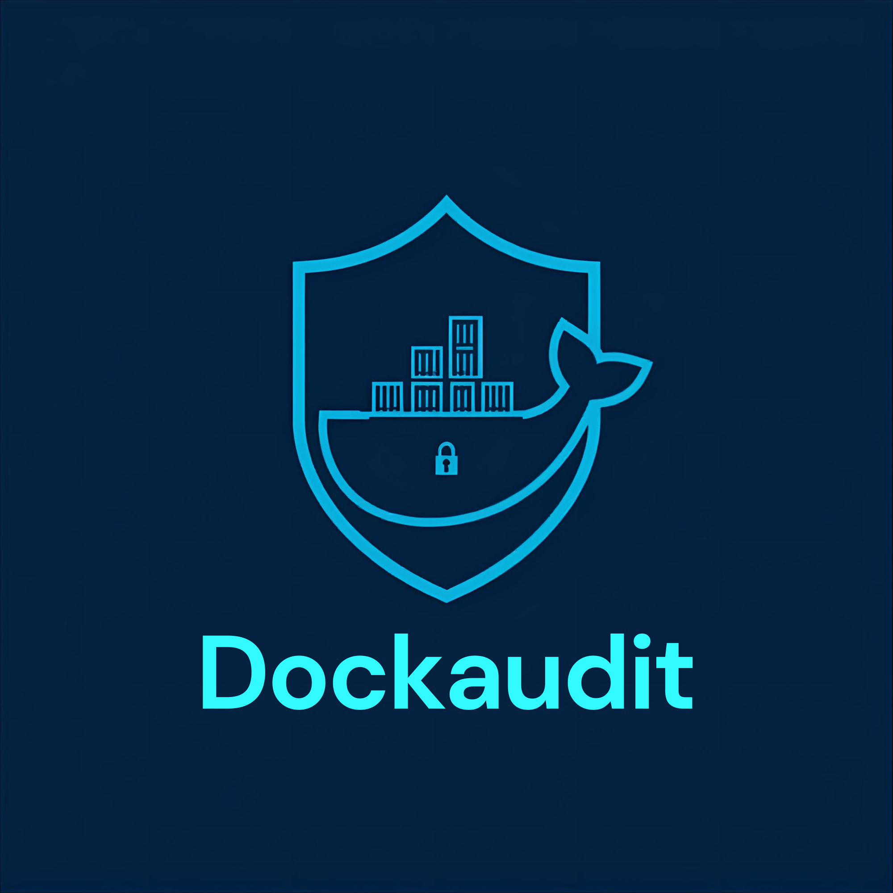

<p align="center">
  
</p>

<h1 align="center">DockAudit</h1>

<p align="center">
  <strong>The Ultimate Pulse for your Docker Infrastructure.</strong><br>
  <em>Audit, Secure, and Monitor your containers in seconds.</em>
</p>

<p align="center">
  
  
  
</p>

---

Most Docker infrastructures are misconfigured. **DockAudit** is a production-grade security auditing tool that unifies container security, performance optimization, and reliability checks into a single, fast interface. Inspired by CIS Docker Benchmarks and powered by real-time intelligence.

## Quick Start (CLI)

Audit your entire local environment with one command:

```bash
docker run \
  -v /var/run/docker.sock:/var/run/docker.sock \
  ercdockercr/dockaudit scan
```

Or install via Pip:
```bash
pip install dockaudit
dockaudit scan
```

---

## V1.0.2: DockAudit Dashboard

Experience real-time monitoring with our new high-fidelity dashboard. Designed with a DevSecOps-centric **Glassmorphism** aesthetic, it provides deep visibility into your operational intelligence.

<p align="center">
  <strong>Global Score • Security Trends • Reliability Metrics • Automated Audits</strong>
</p>

### Deployment

Deploy the full monitoring stack (Frontend + Backend + DB) using Docker Compose:

```bash
# Production Deployment
docker-compose up -d

# Development & Local Build
docker-compose -f docker-compose-dev.yml up --build
```

Access the dashboard at `http://localhost:3000`.

---

## Key Features

- **Multi-Vector Security Scan**: Previleged flags, root capabilities, read-only filesystems, and host-breakout risks.
- **CVE Intelligence**: Integrated with the official **Google OSV API** for real-time vulnerability detection in image layers.
- **Performance Tuning**: Automatically detects missing resource limits (CPU/Memory) and potential sizing issues.
- **Reliability Audit**: Validates restart policies, healthchecks, and orchestration best practices.
- **Secret Detection**: Scans environment variables for leaked credentials, tokens, and sensitive data.
- **Infrastructure Scoring**: Provides actionable KPIs and letter-grade scoring for your entire setup.
- **DevOps Native**: Export findings to **SARIF** or **JSON** for seamless integration with GitHub Security or custom pipelines.

---

## 🛠️ Development

1. **Clone**: `git clone https://github.com/Erico-MR/dockaudit`
2. **Setup**: `pip install -e .`
3. **Explore**: `dockaudit --help`

---

